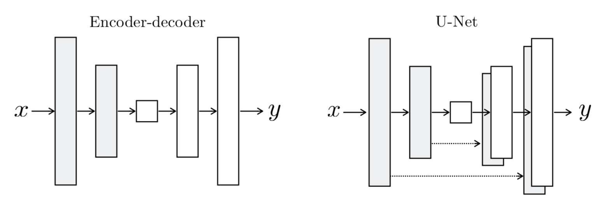

# Image-to-Image Translation with Conditional Adversarial Nets

This is a Tensorflow implementation of ['Image-to-Image Translation with Conditional Adversarial Nets'](https://arxiv.org/pdf/1611.07004.pdf) by Isola, et al. 

This paper showed that conditional generative adversarial networks (cGANs) are broadly applicable in the domain of image-to-image translation. They created a cGAN architecture well-suited to these types of problems, and showed it working well on sketch-to-photo, day-to-night, grayscale-to-color, segmentation-to-photo tasks, and more. 

While there had previously existed specific solutions taylored to many of these problems, a generic framework that can handle all of them is clearly of great value.  

## Generator Architecture

All image-to-image translation problems require the "high-level" features (what is it an image of?) to stay the same, and the surface-level features (how it looks) to change. 

The need to understand and keep the high level essence of the image is well-suited to an <i>encoder-decoder</i> architecture. In this structure, the input image <i>x</i> is fed into the encoder, which makes its feature map smaller and the number of channels bigger at each step until the representation is transformed into a single vector. This vector encapsulates the essential high-level details of the image (e.g., this is a picture of a red flower). This is then fed into the decoder network, which creates an output image. The layer sizes of the decoder exactly mirror those of the encoder.

However, a plain encoder-decoder has some drawbacks. Since all input image information needs to be passed through a bottleneck, some low level details of interest (e.g., the location of edges) can be lost. To solve this, the authors added "skip connections" between corresponding layers in the encoder and decoder. These connections simply concatenate the output of a given encoder layer to the output of the decoder layer of the same size. 

The resulting architecture is called a "U-Net":

<figure>

<figcaption>* This image is taken from the paper.</figcaption>
</figure>

## Discriminator Architecture

PatchGAN.

## Loss Functions

Loss_g = L1_loss (high level features) + GAN_loss (style/texture)

### L1 Loss

* We incorporate an L1 component in the Generator's loss function
    * (expand) Why is GAN + L1 better than GAN?

* L1 or L2 losses are well known to produce blurry images, because they "average" the plausible outputs
    * L1 and L2 losses are direct measures of the pixel-by-pixel difference between the training output y and the generated image. 
    * Of the two, L1 is slightly less blurry (why?)
    * For this reason, we choose to incorporate L1 (over L2).

* Fails to capture low-level features, like texture and style, due to this blurryness
* But, it can capture high-level features (e.g., there should be a cat here!) (is this true?)

### GAN Loss

Restricted to only capture low-level features (like texture and style).

* PatchGAN
    * Tries to classify if each NxN portion of an image is real or fake
    * Averages the output probabilities for all patches to produce one number
    * We use N = 70
    * Assumes non-overlapping images are independent of each other

### Expected Behavior

* By default, we heavily weight toward L1_loss, by a factor of 100. 
    * So, we would expect L1 to dominate training until it is nearly optimized.
    * Then, the GAN factor would take over.
    * The Discriminator quickly trains, is this going to be a problem?
        * It has been an issue for other types of GANs, because the gradients become too random to be of much use.
        * However, since this discriminator is only learning texture/style, maybe its simple enough that its ok.

## Acknowledgements

* [Image-to-Image Translation with Conditional Adversarial Nets](https://arxiv.org/pdf/1611.07004.pdf)

* [Pytorch implementation by Jun-Yan Zhu](https://github.com/junyanz/pytorch-CycleGAN-and-pix2pix)

* [Affinelayer's Tensorflow implementation](https://github.com/affinelayer/pix2pix-tensorflow)
