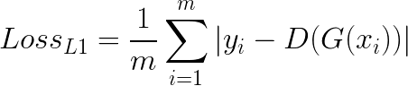
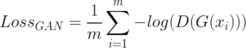
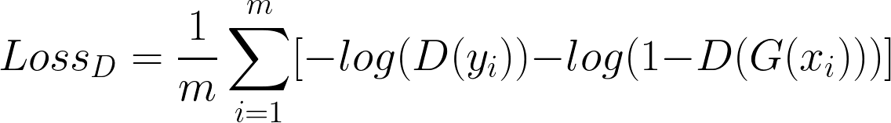

# Image-to-Image Translation with Conditional Adversarial Nets

This is a Tensorflow implementation of ['Image-to-Image Translation with Conditional Adversarial Nets'](https://arxiv.org/pdf/1611.07004.pdf) by Isola, et al. 

This paper showed that conditional generative adversarial networks (cGANs) are broadly applicable in the domain of image-to-image translation. They created a cGAN architecture well-suited to these types of problems, and showed it working well on sketch-to-photo, day-to-night, grayscale-to-color, segmentation-to-photo tasks, and more. 

While there had previously existed specific solutions taylored to many of these problems, a generic framework that can handle all of them is clearly of great value.  

## Generator Architecture: U-Net 

All image-to-image translation problems require the "high-level" features (what is it an image of?) to stay the same, and the surface-level features (how it looks) to change. 

The need to understand and keep the high level essence of the image is well-suited to an <i>encoder-decoder</i> architecture. In this structure, the input image <i>x</i> is fed into the encoder, which makes its feature map smaller and the number of channels bigger at each step until the representation is transformed into a single vector. This vector encapsulates the essential high-level details of the image (e.g., this is a picture of a red flower). This is then fed into the decoder network, which creates an output image. The layer sizes of the decoder exactly mirror those of the encoder.

However, a plain encoder-decoder has some drawbacks. Since all input image information needs to be passed through a bottleneck, some low level details of interest (e.g., the location of edges) can be lost. To solve this, the authors added "skip connections" between corresponding layers in the encoder and decoder. These connections simply concatenate the output of a given encoder layer to the output of the decoder layer of the same size. 

The resulting architecture is called a "U-Net":

<figure>

<figcaption>* This image is taken from the paper.</figcaption>
</figure>

## Discriminator Architecture: PatchGAN

Generally, GANs use a discriminator as an adaptive loss function. This paper uses a discriminator network for <i>one part</i> of the loss function, designed to capture surface level features.  

Since these "texture-like" features do not need to encapsulate the entire image's high-level contents, it is sufficient to evaluate smaller patches of the image. This is both more computationally efficient and allows the discriminator to evaluate arbitrarily large images. This "PatchGAN", as it is called, is fed 70x70 patches of an image, and outputs the probability of each being "real" (as opposed to generated). 

## Loss Functions

The loss function for training the generator uses both an L1-loss component (for high level features), and a PatchGAN component (for style/texture features). The PatchGAN element is essential, because L1-loss alone tends to average plausible outcomes and create blurry images. We weight the relative influence of the L1 and GAN loss with the hyperparameters <b>α</b> and <b>β</b>.

The discriminator is trained with a typical GAN discriminator loss, in which it attempts to maximize D(y), the probability output for real images, and minimize D(G(x)), the probability output for generated images.

## Acknowledgements

* [Image-to-Image Translation with Conditional Adversarial Nets](https://arxiv.org/pdf/1611.07004.pdf)

* [Pytorch implementation by Jun-Yan Zhu](https://github.com/junyanz/pytorch-CycleGAN-and-pix2pix)

* [Affinelayer's Tensorflow implementation](https://github.com/affinelayer/pix2pix-tensorflow)
